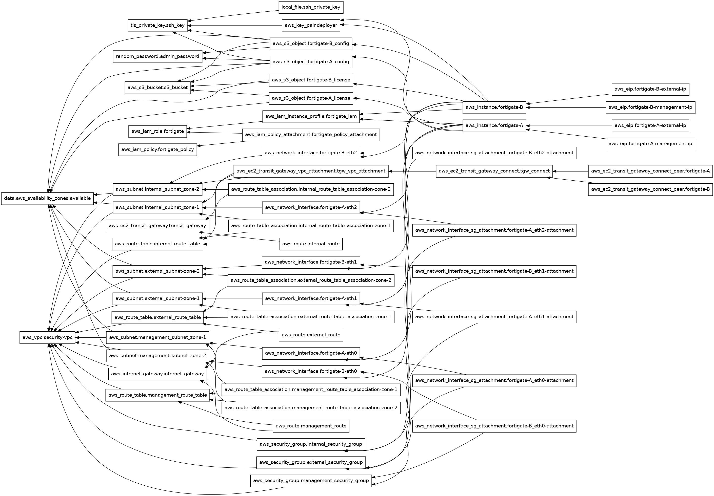

# Fortigate NG Firewall

This repository deploys an HA pair of Fortigate NGFW into an AWS VPC.

## terraform

- Copy fortigate license files in the the ./licenses folder with the name "fortigate-A.lic" and "fortigate-B.lic"

```bash
cp ~/Downloads/FGVM08TM24002938.lic licenses/fortigate-A.lic
cp ~/Downloads/FGVM08TM24002939.lic licenses/fortigate-B.lic
```

- Initialize the terraform provider plugins.

```bash
terraform init
```

- Apply the terraform plan.

```bash
terraform apply -auto-approve
```

- View the login information.

```bash
terraform output -json
terraform output -raw <variable-name>
```

## Accounts

- AWS

```bash
aws configure sso
aws sso login --profile default
```

- GitHub

```bash
gh auth login
```

- Create a branch:

```bash
git branch -C "tweak-Conf-files" "main"
```

- terraform get AZs

```bash
count = length(data.aws_availability_zones.available.names)
availability_zone = data.aws_availability_zones.available.names[count.index]
```

- use loop to build subnets!
- Look up Availability Zones.

```bash
data "aws_availability_zones" "available" {}
```

- Create a subnet

```hcl
resource "aws_subnet" "default" {
  count             = 3
  vpc_id            = aws_vpc.default.id
  cidr_block        = "10.0.${count.index}.0/24"
  availability_zone  = data.aws_availability_zones.available.names[count.index]
}
```

- Create a new branch

```bash
git branch -C "tweak-Conf-files" "main"
```

## Subnet sizing for IPv4

- The allowed IPv4 CIDR block size for a subnet is between a /28 netmask and /16 netmask. The first four IP addresses and the last IP address in each subnet CIDR block are not available for your use, and they cannot be assigned to a resource, such as an EC2 instance. For example, in a subnet with CIDR block 10.0.0.0/24, the following five IP addresses are reserved:

10.0.0.0: Network address.
10.0.0.1: Reserved by AWS for the VPC router.
10.0.0.2: Reserved by AWS. The IP address of the DNS server is the base of the VPC network range plus two. For VPCs with multiple CIDR blocks, the IP address of the DNS server is located in the primary CIDR. We also reserve the base of each subnet range plus two for all CIDR blocks in the VPC. For more information, see Amazon DNS server.
10.0.0.3: Reserved by AWS for future use.
10.0.0.255: Network broadcast address. We do not support broadcast in a VPC, therefore we reserve this address.



<!-- BEGIN_TF_DOCS -->

## Inputs

| Name | Description | Type | Default | Required |
|------|-------------|------|---------|:--------:|
| admin\_sport | Management port for admin UI | `string` | `"443"` | no |
| arch | n/a | `string` | `"x86_64"` | no |
| aws\_region | AWS Region | `string` | `"us-east-1"` | no |
| company | Company name - used as a resource tag | `string` | `"ACME Corp"` | no |
| createdby | Created by - used as a resource tag | `string` | `"Terraform"` | no |
| enable\_dns\_hostnames | Enable DNS hostnames in VPC | `bool` | `true` | no |
| environment | Environment - used as a resource tag | `string` | `"sandbox"` | no |
| fortigate | n/a | ```list(object({ hostname_prefix = string subnet_cidrs = map(string) bgp_asn = number inside_cidr_blocks = list(string) priority = number }))``` | ```[ { "bgp_asn": 64513, "hostname_prefix": "firewall", "inside_cidr_blocks": [ "169.254.120.0/29" ], "priority": 200, "subnet_cidrs": { "external": "10.0.0.0/28", "internal": "10.0.0.16/28", "management": "10.0.0.48/28", "transit": "1.0.0.0/8" } }, { "bgp_asn": 64514, "hostname_prefix": "firewall", "inside_cidr_blocks": [ "169.254.102.0/29" ], "priority": 150, "subnet_cidrs": { "external": "10.0.0.64/28", "internal": "10.0.0.80/28", "management": "10.0.0.112/28", "transit": "1.0.0.0/8" } } ]``` | no |
| fortigate\_bootstrap | Path to fortigate template config | `string` | `"cloud-init/fortigate.conf"` | no |
| fortigate\_license | List of paths to the license files for Fortigate instances | `list(string)` | ```[ "licenses/fortigate-A.lic", "licenses/fortigate-B.lic" ]``` | no |
| interface\_mapping | n/a | ```list(object({ external = list(string) internal = list(string) management = list(string) }))``` | ```[ { "external": [ "0", "public" ], "internal": [ "1", "private" ], "management": [ "2", "ha" ] } ]``` | no |
| license\_type | n/a | `string` | `"byol"` | no |
| project | Project - used as a resource tag | `string` | `"fortigate-ngfw-aws"` | no |
| release | Fortigate Version | `string` | `"7.6.0"` | no |
| size | n/a | `string` | `"c6i.xlarge"` | no |
| subnet\_types | n/a | `list(string)` | ```[ "external", "internal", "management" ]``` | no |
| transit\_gateway\_amazon\_side\_asn | ASN Number on the AWS transit gateway | `number` | `64512` | no |
| vpc\_cidr | Base CIDR Block for VPC | `string` | `"10.0.0.0/24"` | no |
| vpc\_name | VPC name | `string` | `"security"` | no |
<!-- END_TF_DOCS -->
